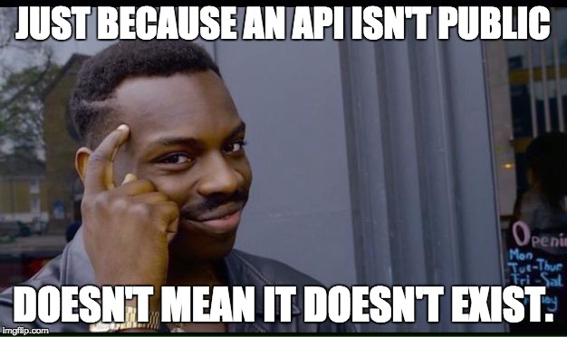

# Title: Incident with Yahoo Finance API

## SUMMARY:
Incident date: On Saturday 15 of May, at 03:15 AM GMT-3, users alert us that the service becomes inaccessible and incapable of retrieves data selected.
The incident impacted a whole web application, and the service was down 1 hour until it was reestablished.
Unexpectedly, the Yahoo Finance API was banned, and it's no longer available to perform queries.

## TIMELINE
3:15 Alert from diverse Users announcing the impossibility to connect and work within the app.
3:17 IT team was notified almost immediately about the emergency
3:25 Web Servers, Databases, Load Balancer, and main check entry points were checked looking for malfunction.
3:45 Firewall and Web app check. At this point, the IT department understands the real root cause of the problem: the Yahoo API was shut down with no notification.
3:50 This risk was propper documented, and planned a mitigation plan, which consists of changing the API data provider to Quandl instead of Yahoo.
4:10 The new API was configured and ready for deployment. Due to our software modularity and lower attachment of modules, replacing the API was relatively quick and effective. 
4:15 Every service was usually running.

## ROOT CAUSE:
Getting data from an unofficial API was a moderate risk was accepted in the initial stages of the app. Later on, with the scale of the app, the problem gets undercovers and never got revisited.
The solution has been orientated to change for an official and trusty data provider as Quandl. 

## CORRECTIVE AND PREVENTIVE ACTIONS:
- Tracking API version and mayors updates.
- Research of new and trusty market data suppliers.
- Reevaluate API supplier cost in costs structure.

Lessons Learned: Never keep growing up without a trusty data provider when your data is your biggest asset.

Author: Martin Saavedra
